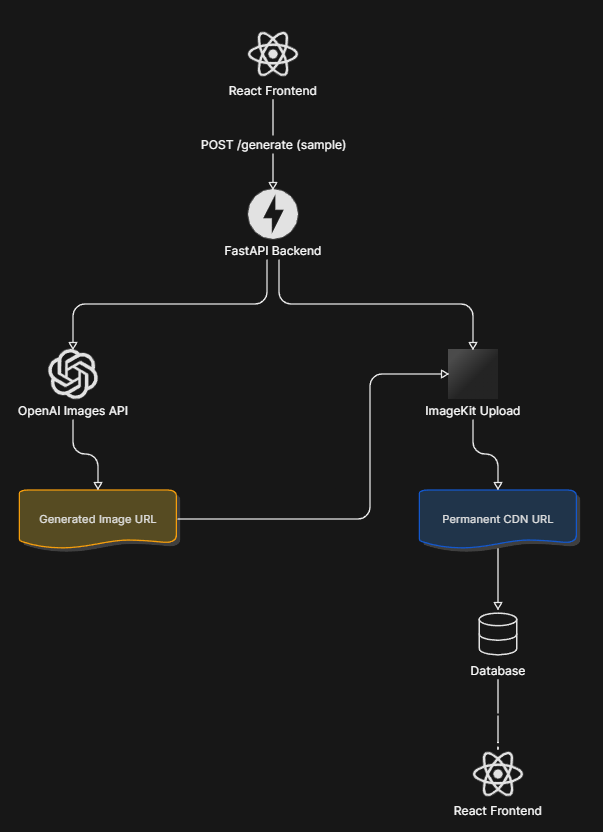

# AI Powered Thumbnail Generator

> This project was created for learning purposes and might not have high quality code.

It uses OpenAI model to create thumbnail by taking following inputs:
- headshot image (either image of a person or base/required image for thumbnail)
- prompt (user prompts are enhanced by adding pre-defined prompts by the server)
- number of thumbnails (atmost 3 distinct thumbnails can be generated)

---

## Work Flow

